

<picture><source media="(prefers-color-scheme: dark)" srcset="assets/dark/banner.svg"></picture>

 

<!-- website pill: add lakshpradhwani.com here once the domain is live -->

<picture><source media="(prefers-color-scheme: dark)" srcset="assets/dark/h01.svg"></picture>


&nbsp;

I'm Laksh, 18, from Varanasi. I build full-stack products and I'm growing into AI/ML engineering. 
These days I'm the tech head at <b>ShiftsDeal</b> and a first-year at <b>Masters' Union</b> studying Data Science and AI. 
Outside code, I'm a national-level 10 m air pistol shooter. Shooting taught me to stay calm under pressure, 
and I bring the same focus to a codebase.

<picture><source media="(prefers-color-scheme: dark)" srcset="assets/dark/h02.svg"></picture>

<picture><source media="(prefers-color-scheme: dark)" srcset="assets/dark/now.svg"></picture>

<picture><source media="(prefers-color-scheme: dark)" srcset="assets/dark/h03.svg"></picture>

<picture><source media="(prefers-color-scheme: dark)" srcset="assets/dark/stack.svg"></picture>

<picture><source media="(prefers-color-scheme: dark)" srcset="assets/dark/h04.svg"></picture>

<a href="https://github.com/TheRealLaksh/Profiley-Resume-Builder"><picture><source media="(prefers-color-scheme: dark)" srcset="assets/dark/card-profiley.svg"></picture></a>
<a href="https://github.com/TheRealLaksh/Helios-Music-Player"><picture><source media="(prefers-color-scheme: dark)" srcset="assets/dark/card-helios.svg"></picture></a>
<a href="https://github.com/TheRealLaksh/Portfolio-V2"><picture><source media="(prefers-color-scheme: dark)" srcset="assets/dark/card-portfolio.svg"></picture></a>
<a href="https://github.com/TheRealLaksh/mercatora"><picture><source media="(prefers-color-scheme: dark)" srcset="assets/dark/card-mercatora.svg"></picture></a>
<a href="https://github.com/TheRealLaksh/Vaultara-GovDoc"><picture><source media="(prefers-color-scheme: dark)" srcset="assets/dark/card-vaultara.svg"></picture></a>
<a href="https://github.com/TheRealLaksh/Aura-PA"><picture><source media="(prefers-color-scheme: dark)" srcset="assets/dark/card-aura.svg"></picture></a>
<a href="https://github.com/TheRealLaksh/stranger-things"><picture><source media="(prefers-color-scheme: dark)" srcset="assets/dark/card-stranger.svg"></picture></a>
<a href="https://github.com/TheRealLaksh/ai-era-infographic"><picture><source media="(prefers-color-scheme: dark)" srcset="assets/dark/card-infographic.svg"></picture></a>

<picture><source media="(prefers-color-scheme: dark)" srcset="assets/dark/h05.svg"></picture>

<picture><source media="(prefers-color-scheme: dark)" srcset="assets/dark/timeline.svg"></picture>

<picture><source media="(prefers-color-scheme: dark)" srcset="assets/dark/h06.svg"></picture>

<picture><source media="(prefers-color-scheme: dark)" srcset="assets/dark/wins.svg"></picture>

<picture><source media="(prefers-color-scheme: dark)" srcset="assets/dark/h07.svg"></picture>

<picture><source media="(prefers-color-scheme: dark)" srcset="assets/dark/stats.svg"></picture>

 

<picture><source media="(prefers-color-scheme: dark)" srcset="assets/dark/heatmap.svg"></picture>

 

<picture><source media="(prefers-color-scheme: dark)" srcset="assets/dark/langs.svg"></picture>

 

<picture><source media="(prefers-color-scheme: dark)" srcset="assets/dark/footer.svg"></picture>

Cards in "By the numbers" refresh twice a day from the GitHub API. Public repositories only.

