


<a href="https://linkedin.com/in/laksh-pradhwani"></a>

<!-- website badge: add lakshpradhwani.com here once the domain is live -->


Hello there! I'm **Laksh Pradhwani**, a full-stack developer. I like building complete products, from the database all the way to the pixel, and I'm learning machine learning to steer towards AI engineering. 

 


<!-- projects:start -->
<a href="https://github.com/TheRealLaksh/Portfolio-V2"></a>
<a href="https://github.com/TheRealLaksh/Profiley-Resume-Builder"></a>
<a href="https://github.com/TheRealLaksh/mp3-downloader"></a>

<a href="https://github.com/TheRealLaksh/Helios-Music-Player"></a>
<a href="https://github.com/TheRealLaksh/Vaultara-GovDoc"></a>
<a href="https://github.com/TheRealLaksh/Portfolio-V1"></a>
<a href="https://github.com/TheRealLaksh/Indias-Got-Latent"></a>
<!-- projects:end -->



 


